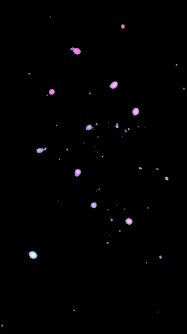
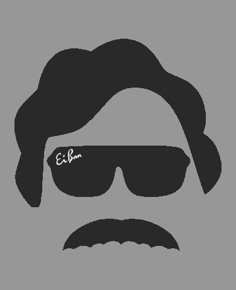
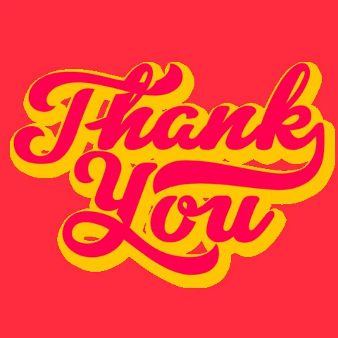

<h1 align="center">WEB3 EVANGELIST . ENTREPRENEUR . HACKER</h1>
<h5  align="center">Don Pablo, if you'll indulge me for a moment, please allow me to introduce myself as a Web 3.0 aficionado. In the past, in addition to running my own business, I've had positions as a software developer, a hacker, and an administrator. My unique professional identity stems from the fact that one of my key responsibilities as a software engineer is the creation of software..</h5>

██████████████████████████╗░░█████╗░██████╗░██╗░░░░░░█████╗░ 
██████████████████████╔══██╗██╔══██╗██╔══██╗██║░░░░░██╔══██╗ 
██████████████████████████╔╝███████║██████╦╝██║░░░░░██║░░██║ 
█▄─▄▄▀█─▄▄─█▄─▀█▄─▄███╔═══╝░██╔══██║██╔══██╗██║░░░░░██║░░██║ 
██─██─█─██─██─█▄▀─████║░░░░░██║░░██║██████╦╝███████╗╚█████╔╝ 
▀▄▄▄▄▀▀▄▄▄▄▀▄▄▄▀▀▄▄▀╚═╝░░░░░╚═╝░░╚═╝╚═════╝░╚══════╝░╚════╝░ 
 

<figure><embed src="https://wakatime.com/share/@donPabloNow/dd2ebf83-0e28-4fff-b15b-05eb5b8eb7bb.svg"></embed></figure>

       
    
    

 
 

    

    

 

    

 

LUCKY VISITOR NUMBER 

 

 

 

 

 

<a href="https://www.twitter.com/donPabloNow"> <a href="https://instagram.com/donPabloNow/"> 

  
Hows it? Introduction & Content Index 
ᵀʰᵉ ᵗᵉʳᵐ ᵂʰᵃᵗˢ ᴾᵒᵖᵖᶦⁿ ᶦˢ ᵃ ᵍʳᵉᵉᵗᶦⁿᵍ ᵐᵉᵃⁿᶦⁿᵍ ᵂʰᵃᵗˢ ᴳᵒᶦⁿᵍ ᵒⁿ  
 
Information. Video Biography 
ᴬⁿᵒᵗʰᵉʳ ᵗᵉʳᵐ ᵘˢᵉᵈ ᶠᵒʳ "ᶦⁿᶠᵒʳᵐᵃᵗᶦᵒⁿ" ᴴᵉⁿᶜᵉ ᵈᶦᵃˡᶦⁿᵍ ⁴¹¹ ᶠᵒʳ  ᶦⁿᶠᵒʳᵐᵃᵗᶦᵒⁿ ᴰᵃᵐⁿ ˢʰᵉ'ˢ ᶠᶦⁿᵉ ᴵ ᵃᵐ ᵍᵒⁿⁿᵃ ᵍᵒ ᵍᵉᵗ ᵗʰᵉ ⁴¹¹ ᵒⁿ
ʰᵉʳ  
 
Money. Current Projects and Work 
ᶜᵒᶜᵏⁿᵉʸ ᴿʰʸᵐᶦⁿᵍ ˢˡᵃⁿᵍ ᶦⁿ ᴬᵐᵉʳᶦᶜᵃⁿ ᴱⁿᵍˡᶦˢʰ  "ᵇʳᵉᵃᵈ" ᵇʳᵉᵃᵈ ᵃⁿᵈ ʰᵒⁿᵉʸ ᵐᵉᵃⁿˢ ᵐᵒⁿᵉʸ  
 
You only live once. Personal Blog 
ʸᴼᴸᴼ - ᵃᶜʳᵒⁿʸᵐ ᵐᵉᵃⁿᶦⁿᵍ ʸᵒᵘ ᵒⁿˡʸ ˡᶦᵛᵉ ᵒⁿᶜᵉ ᵘˢᵉᵈ ᵗᵒ ᵉˣᵖʳᵉˢˢ ᵗʰᵉ  ᵛᶦᵉʷ ᵗʰᵃᵗ ᵒⁿᵉ ˢʰᵒᵘˡᵈ ᵐᵃᵏᵉ ᵗʰᵉ ᵐᵒˢᵗ ᵒᶠ ᵗʰᵉ ᵖʳᵉˢᵉⁿᵗ
ᵐᵒᵐᵉⁿᵗ ʷᶦᵗʰᵒᵘᵗ ʷᵒʳʳʸᶦⁿᵍ ᵃᵇᵒᵘᵗ ᵗʰᵉ ᶠᵘᵗᵘʳᵉ  
 
Swimming in Riches like Scrooge McDuck. Donations always Welcome! 
ᵀᵒ ᵈᶦᵛᵉ ʰᵉᵃᵈᶠᶦʳˢᵗ ᶦⁿᵗᵒ ᵃ ᵖᵒᵒˡ ᵒᶠ ᵍᵒˡᵈ ᶜᵒᶦⁿˢ  ˡᶦᵗᵉʳᵃˡˡʸ ˢʷᶦᵐᵐᶦⁿᵍ ᵗʰʳᵒᵘᵍʰ ʸᵒᵘʳ ʷᵉᵃˡᵗʰ ᵃⁿ ᵃᶜᵗᶦᵛᶦᵗʸ ᵖᵒᵖᵘˡᵃʳᶦᶻᵉᵈ ᵇʸ ᶦᵗˢ
ⁿᵃᵐᵉˢᵃᵏᵉ  
 
Contact Me. Where to Contact Me 
ᴴᵒˡˡᵃ ᵇᵃᶜᵏ! ˢˡᵃⁿᵍ ᴹᵃᵏᵉ ˢᵒᵐᵉ ⁿᵒᶦˢᵉ ᵇʸᵉ ˢᵉᵉ ʸᵒᵘ  ˡᵃᵗᵉʳ ᵍᵉᵗ ᵇᵃᶜᵏ ᵗᵒ ᵐᵉ ʳᵉᵖˡʸ ᵗᵒ ᵐᵉ!  
 
Credibility. References and Testimonials 
ᴹᵉᵃⁿˢ ᵗʰᵉ ᑫᵘᵃˡᶦᵗʸ ᵒᶠ ᵇᵉᶦⁿᵍ ᵇᵉˡᶦᵉᵛᵃᵇˡᵉ ᵒʳ ʷᵒʳᵗʰʸ ᵒᶠ ʳᵉˢᵖᵉᶜᵗ  ᵉˢᵖᵉᶜᶦᵃˡˡʸ ʷᶦᵗʰᶦⁿ ᵃ ᵖᵃʳᵗᶦᶜᵘˡᵃʳ ˢᵒᶜᶦᵃˡ ᵖʳᵒᶠᵉˢˢᶦᵒⁿᵃˡ ᵒʳ
ᵒᵗʰᵉʳ ᵍʳᵒᵘᵖ  
 
Skills. Coding Languages, Tools and Frameworks 
ᵀʰᵉ ᵃᵇᶦˡᶦᵗʸ ᶜᵒᵐᶦⁿᵍ ᶠʳᵒᵐ ᵒⁿᵉ'ˢ ᵏⁿᵒʷˡᵉᵈᵍᵉ ᵖʳᵃᶜᵗᶦᶜᵉ  ᵃᵖᵗᶦᵗᵘᵈᵉ ᵉᵗᶜ ᵗᵒ ᵈᵒ ˢᵒᵐᵉᵗʰᶦⁿᵍ ʷᵉˡˡ  
 
Friends. Acknowledgements and Contributors 
ᴬ ᵖᵉʳˢᵒⁿ ᶠʳᵒᵐ ᵒⁿᵉ'ˢ ʰᵒᵐᵉ ᵗᵒʷⁿ ᵒʳ ⁿᵉᶦᵍʰᵇᵒʳʰᵒᵒᵈ ᵃ ᵐᵉᵐᵇᵉʳ  ᵒᶠ ᵒⁿᵉ'ˢ ᵖᵉᵉʳ ᵍʳᵒᵘᵖ ᵒʳ ᵍᵃⁿᵍ ᵃ ʰᵒᵐᵉᵇᵒʸ ᵒʳ ʰᵒᵐᵉᵍᶦʳˡ  
 
Bling. Certifications and Education 
ᴰʳᶦᵖ ᵘˢᵉᵈ ᵃˢ ˢˡᵃⁿᵍ ᵐᵉᵃⁿˢ ˢᵗʸˡᵉ ᵖᵃʳᵗᶦᶜᵘˡᵃʳˡʸ ᶠᵃˢʰᶦᵒⁿᵃᵇˡᵉ ᵃⁿᵈ ˢᵉˣʸ ˢᵗʸˡᵉ ᴵᵗ ᶜᵃⁿ ᵉˢᵖᵉᶜᶦᵃˡˡʸ  ʳᵉᶠᵉʳ ᵗᵒ ᵗʰᶦⁿᵍˢ ˡᶦᵏᵉ ᶦᶜᵉ
ʷʰᶦᶜʰ ᶦˢ ᵉˣᵖᵉⁿˢᶦᵛᵉ ʲᵉʷᵉˡʳʸ ᵒᶠᵗᵉⁿ  

 

 

 

 
  

 

<h1>The 411 / Information - Introduction Video</h1>

 

 
<h1>Hello World, my name is (don) </h1>

 

 

  

 

<h1>Bread & Honey / Money - Current Work and Projects</h1>

 

🔭 I’m currently working on The Mean Operating System - The first decentralized, artificially intelligent, MEAN.js stack, operating system. Mean OS is the only operating system hosted anonymous using a P2P network and a suite of non-standard in-browser delivery mechanisms. Mean OS proudly supports Brave and Tor, be free!
 
 
🌱 I’m currently learning Kubenetes, Crypto, Distributed Storage 

  

👯 I’m looking to collaborate on Various Projects, give me a holla!

💬 Talk to me about Anything, very interested in a wide range of topics :)

🔭 I’m currently working on [MeanOS](https://github.com/donspablo/MeanOs)

👨‍💻 All of my projects are available at [https://github.com/donspablo](https://github.com/donspablo)

📝 I regularly write articles on [https://www.medium.com/donPabloNow](https://www.medium.com/donPabloNow)

💬 Ask me about **anything**

📫 How to reach me **@donPabloNow**

📄 Know about my experiences [https://www.linkedin.com/in/donPabloNow](https://www.linkedin.com/in/donPabloNow)

⚡ Fun fact **I am a funny guy and love making music**

 

"No matter how brilliant your mind or strategy, if you're playing a solo game, you'll always lose out to a team" ~ Reid Hoffman

 

  

   

 

 

 

<h1>Yolo / You Only Live Once - Personal Blog</h1>

 

<!-- BLOG-POST-LIST:START -->
- [Firefox OS, B2G &lpar;Boot to Gecko&rpar; &amp; Kia OS — Be the FUTURE](https://medium.com/meanos/firefox-os-b2g-boot-to-gecko-kia-os-be-the-future-86690bd45b4b?source=rss-c4c44819bad7------2)
- [The Writer’s Guide to the Galax — One Thousand Ways to Make a Million Dreams Come True](https://medium.com/techverge/the-writers-guide-to-the-galax-one-thousand-ways-to-make-a-million-dreams-come-true-9be95506bb49?source=rss-c4c44819bad7------2)
- [Alien Fossils on Mars are Life-mimicking with Non-biological Origins — NASA](https://medium.com/techverge/alien-fossils-on-mars-are-life-mimicking-with-non-biological-origins-nasa-8e5b0816aac2?source=rss-c4c44819bad7------2)
- [MEAN OS — A WEB 3 DISTRIBUTED OPERATING SYSTEM](https://medium.com/meanos/mean-os-a-web-3-distributed-operating-system-ed2205d23fd2?source=rss-c4c44819bad7------2)
<!-- BLOG-POST-LIST:END --> 

 

   

  

 

<h1>Scrooge McDuckin / Swimming in Donations</h1>

 

     

 

 

  

 

<h1>Holla Back / Contact Me - How to contact me</h1>

 

 

 

  

 

<h1>Cred / Credibility - References and Work Experience</h1>

 

[References (99+)](https://za.linkedin.com/in/donPabloNow "LinkedIn") Director (BGIS) President (Rock Hammer) Project Manager (Philips) Director (Jago®) Tech Lead (Property24) Tech Lead (Allan Gray) Project Lead (Auto Trader) [...](https://www.freelancer.com/u/uxdev "Freelancer")

[Endorsements (99+)](https://za.linkedin.com/in/donPabloNow "LinkedIn") C# (25), PHP (16), JavaScript (19), Software Development (38), Agile Methodologies (26), Graphic Design (8), Web Services (9), Scrum (25), SQL (30), ASP.NET (9) [...](https://za.linkedin.com/in/donPabloNow "LinkedIn")

[Certifications (21)](https://za.linkedin.com/in/donPabloNow "LinkedIn") Six Sigma (CSSC), eBSI Academy, Google  Academy, LinkedIn Academy, BitDegree [...](https://za.linkedin.com/in/donPabloNow "LinkedIn")

[Jobs (11)](https://za.linkedin.com/in/donPabloNow "LinkedIn") Handy Cats, Property24, Naked Snacks, Naspers Limited, Korbitec, Jago® [...](https://za.linkedin.com/in/donPabloNow "LinkedIn")

[Education (9)](https://za.linkedin.com/in/donPabloNow "LinkedIn") | Harvard University, Kiron, eBSI Export Academy, Damelin, Waldorf [...](https://za.linkedin.com/in/donPabloNow "LinkedIn")

[Awards (3)](https://za.linkedin.com/in/donPabloNow "LinkedIn") | Kiron University, Awwwards [...](https://za.linkedin.com/in/donPabloNow "LinkedIn")

  

 

<h1>Skills / Skills - Mad Skills</h1>

 

 
 

  

  

<h1>Homies / Friends - Acknowledgements and Contributors</h1>

 

<b>A really massive THANK YOU! Goes out to the Guys and Girls, who made this profile possible:</b>
 

[GitHub profile README generator](https://rahuldkjain.github.io/gh-profile-readme-generator/) Generate GitHub profile README easily with the latest add-ons like visitors count, GitHub stats, etc using minimal UI.

[Github Readme Quotes](https://github.com/PiyushSuthar/github-readme-quotes) Add Programming Quotes To Your GitHub Readme

[Blog post workflow](https://github.com/gautamkrishnar/blog-post-workflow) Show your latest blog posts from any sources or StackOverflow activity or Youtube Videos on your GitHub profile/project
readme automatically using the RSS feed

[GitHub Profile Views Counter](https://github.com/antonkomarev/github-profile-views-counter) It counts how many times your GitHub profile has been viewed. Free cloud micro-service.

[Readme Typing SVG](https://github.com/denvercoder1/readme-typing-svg) Dynamically generated, customizable SVG that gives the appearance of typing and deleting text. Typing SVGs can be used
as a bio on your Github profile readme or repository.

[Badges - Shields](https://github.com/Ileriayo/markdown-badges) Badges for your Profile and Projects.

[Spotify Recently Played README](https://github.com/JeffreyCA/spotify-recently-played-readme) Display your recently played Spotify tracks on your GitHub profile README.

[GitHub streak](https://github.com/denvercoder1/github-readme-streak-stats) Stay motivated and show off your contribution streak! Display your total contributions, current streak, and longest
streak on your GitHub profile README

[GitHub Profile Trophy](https://github.com/ryo-ma/github-profile-trophy) Add dynamically generated GitHub Stat Trophies on your readme

[GitHub Readme Stats](https://github.com/anuraghazra/github-readme-stats) Dynamically generated stats for your github readmes

[Giphy](https://github.com/Giphy) GIPHY is your top source for the best & newest GIFs & Animated Stickers online. Find everything from funny GIFs, reaction GIFs, unique GIFs and more.

 

<b>Thank you for making Github, Beautiful Again!</b>

 
 

  

 
 

<h1>Drip / Bling - Certification and Education</h1>

 

🅲🅴🆁🆃🅸🅵🅸🅴🅳 Google™ Sigma™ PMEC™ Udemy™ Hubspot™ LinkedIn™ Microsoft™ - MEAN.js, WAMP.net(C#), LAMP.php stack and
Agile, CC, S.O.L.I.D, DRY and TDD practitioner with 15+ years of experience.

"Master programmers think of systems as stories to be told rather than programs to be written" - Robert C. Martin, aka,
Uncle Bob

♚ ♛ ♜ ♝ ♞ ♟ ♔ ♕ ♖ ♗ ♘ ♙

